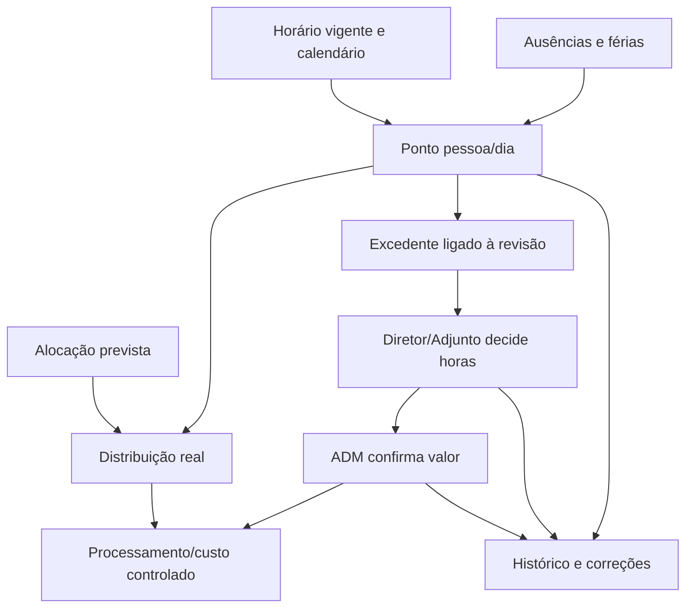

# Auditoria Ponto + Alocação + Horas Extra — 01/10/2026

## 1. Escopo e evidência

Base verificada: origin/main `9e0e6c40b439160201289823db8cfee0b9adad02`. Branch própria: `audit/ponto-alocacao-horas-extra-20261001`. Somente este relatório é publicado; nenhum módulo é implementado ou corrigido.

Fontes: código dessa base; schema, funções, triggers, grants, RLS, índices e dados reais do Supabase Primeline-Obras, através da sessão Chrome autenticada e SQL com read_only=true. O HTTP de produção confirmou `src/app.js?v=169`, o fluxo DELETE→POST e ausência de chamada `rpc/fn_quadro_operar`. Perfil visível: Gestão da Plataforma, com tabs Ponto e HE. Não houve gravação, simulação de writes, troca de conta ou deploy.

**Conclusão:** Quadro e Ponto interpretam datas de forma diferente; a RPC segura de movimentação existe, mas não é usada no frontend observado; HE é manual e independente; custo provém de lançamentos separados. O modelo pedido é viável, porém a ativação financeira deve ser um pacote separado com reconciliação.

## 2. Fotografia real

| Entidade | Linhas | Datas / composição |
|---|---:|---|
| ponto_pessoal_obra | 0 | Nenhuma presença/justificação persistida |
| horas_extraordinarias | 0 | Nenhuma HE/pagamento persistido |
| quadro_pessoal_alocacao | 227 | 08/07–02/10/2026; 218 obra, 8 pontual, 1 escritório; 226 dia inteiro, 1 manhã |
| quadro_pessoal_movimentos | 98 | 25–30/09/2026; 97 adicionadas, 1 retirada; 2 sem antes/depois |
| lancamentos_mao_obra | 624 | 30/11/2023–30/06/2026; 555 diários +69 mensais; 8 648,78h; 172 353,49€ |
| ausencias | 579 | 02/01–31/12/2026; 578 férias confirmadas +1 falta injustificada pendente |
| afetacao_semanal / fecho_mensal_obra | 0 / 0 | Sem dados |
| colaboradores | 48 | 7 com utilizador_id |
| alertas de HE | 0 | Nenhum órfão deste tipo |

Não encontrados duplicados exatos de alocação, alocações tipo obra com obra NULL, alocações após data_saida, nem órfãos de pessoa em Quadro, HE, ausências ou custos. Ponto/HE vazios não demonstram segurança do fluxo futuro.

27 pares de alocações sobrepostas no mesmo dia/período e destino diferente: 22 pares de 3 colaboradores `Enc. Obra` e 5 pares de 1 `Pedreiro`. Pares não equivalem a pessoas ou dias. Multialocação do encarregado pode ser deliberada; a do pedreiro exige confirmação humana, sem deduzir horas trabalhadas.

Coexistências de ausência e alocação:

| Data | Alocação ID | Ausência ID | Situação |
|---|---|---|---|
| 29/09/2026 | 31600ef3-c950-4a68-8aa6-69782dee9a40 | 7f6dabfa-5a02-49f6-8fda-ae2b28fefaec | Férias confirmadas |
| 01/10/2026 | 4ae930ee-7019-4c43-9421-e4272288db0c | aeae7624-7a16-4853-9ad3-9ccb5f77ec3c | Falta injustificada ausente_pendente |

Ambas da pessoa `a441f83a-8de3-4618-94bf-6126326eacf6`. Nenhum ponto/custo do dia foi criado para comprovar trabalho. Triggers bloqueiam nova alocação em ausência, mas não eliminam coexistências quando a ausência é posterior.

**Divergência temporal em 01/10:** reprodução SELECT do algoritmo instalado do Ponto encontra 20 pessoas em obra; alocações da data exata abrangem 16. São 8 períodos herdados de dias anteriores. A contagem diária é da tabela, antes dos filtros visuais de função. Pelo algoritmo persistente: obra32=1 pessoa;79=6;114=1;118=3;120=4;121=2;122=1;128=2.

## 3. Entidades e isolamento atual

O apêndice registra campos, PK/FKs, constraints, RLS, grants e triggers reais. Scripts antigos não foram usados como prova de instalação.

| Entidade | Finalidade / empresa | Leitura / escrita | Histórico / concorrência |
|---|---|---|---|
| ponto_pessoal_obra | Presença pessoa+obra+data; empresa explícita, obra obrigatória | Sem grant/policy authenticated na tabela; RPCs SECURITY DEFINER | Log instalado, autores inicial/último; sem revisão/request_id |
| quadro_pessoal_alocacao | Localização por data/período; empresa através da pessoa/obra | authenticated CRUD com RLS; ADM/Gestão; encarregado por permit interno RPC | Lock advisory por pessoa; movimentos e log; DML direto ADM ainda possível |
| quadro_pessoal_movimentos | Histórico com empresa, antes/depois, nomes e autor | authenticated SELECT; empresa+gestor ou encarregado origem/destino | Não editável pela app; sem revisão/idempotência |
| quadro_pessoal_rpc_permit | Permissão transacional privada | Sem acesso authenticated; interno à RPC | Não é histórico nem versão |
| afetacao_semanal | Percentual por pessoa/obra/dia/semana | Sem grant/policy authenticated | Trigger soma<=1; sem revisão; zero linhas |
| horas_extraordinarias | HE manual por pessoa/obra/data | authenticated CRUD por fn_e_administrativo | Log; autor declarativo; sem fonte Ponto/valor/revisão |
| ausencias / anexos | Ausência por pessoa/data e ficheiros | Férias SELECT authenticated; demais/CRUD ADM via helper | Log, normalização; sem revisão/soft cancel |
| lancamentos_mao_obra | Custo diário/mensal independente, pessoa/obra, TEE/artigo opcionais | Admin CRUD; obra autorizada/Financeiro SELECT | Log; lock pessoa/mês e validação; sem ponto_id/he_id |
| colaboradores | Identidade RH, empresa, admissão/saída/valor_hora/login nullable | Gestores CRUD; técnicos ativos sob policy ampla | Cadastro RH controlado existente; não alterar |
| utilizadores | Login/perfil/ativo/empresa/auth_user_id | Gestão CRUD; próprio/ADM lê | Ator via fn_utilizador_atual_id |
| obras / obra_responsaveis / permissoes_obra | Contexto e responsabilidade por UUID | RLS/helpers; permissoes_obra sem grant authenticated | Não representam presença nem alocação |
| alertas | Pendência por entidade, role, login/pessoa/obra/ocorrência | Grants CRUD com RLS; admin ALL, demais SELECT contextual | Resolver alerta não decide HE |
| feriados_empresa | Calendário por empresa/data/âmbito/município | SELECT true authenticated; gestor/ADM escreve | Ponto não aplica expectativa do calendário |
| fecho_mensal_obra | Fecho obra/mês/autor | Sem grant/policy authenticated | Não protege Ponto/HE; zero linhas |

Não existem FKs de outras tabelas para Ponto ou HE. Não foi encontrada view dedicada que una Ponto, HE e custo; as projeções financeiras têm fontes próprias.

**Isolamento insuficiente:** policies de HE e ausências usam helper global de perfil, sem empresa na linha. SELECT de Quadro é fn_pode_consultar_quadro(), sem tenant na policy. Colaboradores/auxiliares também contêm policies globais. RPCs que validam empresa não tornam seguras policies diretas mais amplas. `fn_guardar_ponto_obra` verifica empresa do colaborador, mas no ramo administrativo não valida expressamente empresa da obra; FKs separadas não impõem igualdade. A leitura do Ponto valida a obra/empresa. Não se explorou acesso entre empresas.

## 4. Ponto: funcionamento atual

Frontend `src/attendance.js`, criado em `src/app.js` por createAttendanceModule. Obra é obrigatória na UX; sem equipa pede alocação no Quadro. Não há registo pessoal de escritório.

`fn_listar_ponto_obra(data,obra)`: utilizador ativo, ADM/Gestão/helpers admin ou encarregado. Filtra obras da empresa em preparação/em_curso/receb_provisoria; encarregado só suas obras. Equipa: expande dia inteiro em manhã/tarde; q.data<=dia; escolhe última linha por pessoa/período, data DESC/criado_em DESC/id DESC; depois filtra obra e tipo obra. Só colaboradores atualmente data_saida NULL: histórico de quem saiu depois pode desaparecer desta vista. Guardar não repete o filtro de ativo/admissão do listing.

`fn_guardar_ponto_obra`: recebe obra, pessoa, data, estado, quatro tempos e observação. Guarda períodos da alocação, horas, justificacao_estado, registado_por/atualizado_por e timestamps. Sem versão/request_id/expected_revision.

- Presente: exige tempos dos períodos alocados, saída>entrada, sem sobreposição manhã/tarde. Horas são duração manhã+tarde; intervalo entre ambas excluído. RPC permite 0<h<=16; constraint da tabela aceita 0–24.
- Ausente: horas0 e temposNULL. Estados presente/falta_com_justificacao/falta_sem_justificacao. Justificação exige observação e fica pendente; restante nao_aplicavel.
- Férias/ausência confirmada ou justificada: bloco bloqueado na UI; backend recusa presente. Não cria ponto FÉRIAS nem gera falta automática por ausência de ponto.
- Defaults hardcoded 08–12/13–17. Não existe cadastro de horário nem divisão normal/extra. 08–12/13–19 guarda10h, sem criar HE.
- UNIQUE(pessoa,obra,data) + UPSERT evitam duplicação nessa obra/dia. Não existe identidade pessoa/dia independente da obra.
- Correção é o mesmo UPSERT, sem motivo obrigatório/revisão/aprovação. Reenvio de falta justificada redefine para pendente, mesmo se validada.
- `fn_validar_justificacao_ponto`: ADM/Gestão, decide validada/rejeitada. Não compara revisão/texto visto nem exige estado anterior pendente. Não é aprovação geral de presença.
- Log técnico instalado para INSERT/UPDATE/DELETE; não existe histórico funcional visível, motivo obrigatório ou soft cancel.
- Não há janela de edição, bloqueio de passado ou mês fechado nestas RPCs.
- Verifica sobreposição noutras obras com SELECT sem lock comum pessoa/dia: duas transações podem passar. Na mesma obra a escrita serializa pela unique, mas a última alteração vence sem aviso.
- Corrigir Ponto não atualiza HE nem custos nos fluxos/triggers instalados.

### Perfis

| Perfil | Ponto | Quadro | HE |
|---|---|---|---|
| Administrativo | Regista/edita, valida justificação, exporta | UI/backend permitem | Lança/vê por_pagar; CRUD backend |
| Gestão Plataforma | Idem; tabs confirmadas na sessão real | UI/backend permitem | Idem |
| Gerência/admin por helper | Ponto permitido | UI permite, mas fn_pode_gerir_quadro real só gestao_plataforma/administrativo: divergência | Helper administrativo permite |
| Diretor | Team só Férias; sem próprio Ponto; RPC listar recusa | Vista e UI de edição sugeridas; backend não permite gestão geral | Sem tab/ação; RLS atual recusa |
| Adjunto | Só Férias, sem próprio Ponto | Sem workforce | Sem aprovação operacional |
| Preparador | Só Férias, sem próprio Ponto | Sem workforce | Pode constar no autorizado_por declarativo, não aprova |
| Encarregado | Equipa nas obras autorizadas, não valida justificação | Vista; DML direto bloqueado; RPC minha_obra existe, app não chama | Sem ação/valor |
| Sem login | Encarregado/ADM representa a pessoa por UUID | Não precisa login | Futuro modelo também não deve exigir login |

`canOpenTeamTab`, canManageTeam/Overtime/Workforce e access-control não coincidem com todos os helpers da BD. Perfis alternativos verificados no código/schema, não por gravação/troca de conta. No guardar, técnico só passa se também for encarregado autorizado; não há capability própria de Diretor/Adjunto.

## 5. Quadro / Alocação: temporalidade e movimentação

**Resposta C: combinação inconsistente.** Tabela contém data/período, sem fim/vigência. `effectiveWorkforceForDate()` usa apenas data===dia. Ponto usa última anterior. Cadastro inicial cria alocação na admissão: no Quadro não preenche dias seguintes; no Ponto pode vigorar indefinidamente.

`saveWorkforceAllocation()`:

1. Pessoa/destino/data, férias e conflitos locais.
2. Não-múltiplo +dia inteiro+origem: DELETE todas linhas pessoa/data, depois POST novo destino: duas transações HTTP.
3. Meio dia com conflito: PATCH; retorna se sucesso. Não é sempre DELETE→POST.
4. Encarregado/permite_multiplas_obras: POST adicional, vários destinos possíveis.
5. Remover: DELETE dos IDs ou pessoa/data/período. Sem tombstone que encerre vigência.
6. Renomear destino livre: PATCH por tipo/descrição, sem revisão.

Se POST falhar por rede, concorrência de ausência, constraint ou permissão, DELETE prévio permanece. Quadro perde alocação; Ponto pode recuperar origem antiga pela última anterior. Remover um evento não encerra o modelo contínuo.

Escritório/garantia/pontual: obraNULL+descrição. Frontend permite gerir escritório aos gestores; nesta função canManageWorkforceWork recusa tipos garantia/pontual, embora renderizados/existentes. Não ampliar sem decisão. `workforceRoleClass` usa função e roster por nome; ímanes operacionais não abrangem automaticamente Diretor/Adjunto/Preparador. Responsáveis fixos são utilizadores, não presença; IDs de colaborador e utilizador não são intercambiáveis.

**Backend melhorado:** `fn_quadro_operar(acao,dados,confirmar,versao)` já instalado: adicionar/mover/remover/corrigir/minha_obra, preview hash de snapshot+pedido, lock advisory pessoa e origem FOR UPDATE, UPDATE/INSERT/DELETE dentro de transação e histórico por trigger. Encarregado limitado a minha_obra com permit privado por transação. DML direto ADM permanece permitido. Não existe request_id/revisão monotónica; MD5 de snapshot não substitui idempotência. Trigger de conflito rejeita apenas identidade duplicada, não todos os destinos sobrepostos. Nenhum teste concorrente real foi feito nesta auditoria.

## 6. Horas Extra atuais

**Entrada manual independente do Ponto**, POST direto por ADM/Gestão. Campos pessoa/obra/data/horas/motivo opcional/autorizado_por opcional/estado_pagamento por_pagar ou pago/data_pagamento. Sem ponto_id, valor sugerido/confirmado, cálculo, decisão operacional, revisão/request ou processamento.

UI só consulta por_pagar; apresenta formulário/lista, sem editar/cancelar/rejeitar/aprovar/confirmar valor/processar/marcar pago/histórico. Backend autoriza CRUD por fn_e_administrativo; ausência de botão não protege contra DML direto.

Trigger fn_validar_autorizacao_horas_extra exige obra e horas>0, valida autorizado_por se indicado como utilizador ativo responsável da obra com papel diretor/adjunto/preparador. **Não exige que esse utilizador esteja a decidir nem cria aprovação.** Campo é declarativo; Preparador pode ser escolhido hoje, contrário ao modelo alvo. Obra nullable no DDL é obrigatória pelo trigger.

Após INSERT cria alerta horas_extra, título por pagar, role rh; rh não é perfil observado. ADM/Gestão veem por helper amplo e técnicos podem ver por obra, mas isso não representa encaminhamento operacional deliberado. Não encontrado reconciliador de HE para corrigir/pagar/cancelar. Log instalado, sem histórico funcional próprio. Só PK unique: não impede HE duplicada por mesma origem/dia.

Ponto10h+HE2h não somam custo automaticamente hoje, mas podem ser importados/manualmente duplicados. Editar Ponto não atualiza HE; editar HE não atualiza Ponto. Não há duplicação atual demonstrada nessas tabelas vazias.

## 7. Custos / Financeiro

Nenhuma função/trigger de Ponto ou HE lida gera custo em lancamentos_mao_obra. Custos atuais vêm de624 lançamentos independentes. Momento económico atual: **ao persistir o lançamento financeiro de mão de obra**, não ao aprovar Ponto/HE ou pagar HE.

`fn_importar_mapa_gestao` é importação financeira separada; fn_mapa_gestao_obras inclui mão de obra como custo realizado, fn_mapa_gestao_obras_excel mostra mensal explícito; production-dashboard soma lancamentos_mao_obra por data. fn_custo_real_ligado agrega por obra/TEE/artigo. fn_resumo_custos_obra usa orçamento/componentes/subempreitadas/ajustes, não um motor derivado de Ponto.

Tabela custo: horas x valor_hora snapshot, valor_total gerado, percentual_afetacao, diario/mensal. Não possui evidência bancária/estado de pagamento de salário; não chamar172353,49€ pagamento efetivo comprovado.

`fn_mgo_validar_periodo_mao_obra`+trigger usam lock pessoa/mês: rejeitam mensal com outras horas da mesma obra/mês, diário sobre mensal, diário em ausência, diário>24h, mensal acima duração do mês. Outro trigger limita soma afetação<=100% por pessoa/data. Não ligam Ponto/HE e não provam reconciliação de todos os legados.

69 totais mensais não podem virar dias/horários inventados. Novo custo requer origem/revisão idempotente, conciliação dos legados e regra para separar remuneração base de suplemento HE. Custo fechado corrigido por ajuste/contrapartida auditada, não sobrescrita silenciosa. Financeiro não é alterado nesta auditoria.

## 8. Revalidação RH

| Ocorrência | Resultado | Evidência atual |
|---|---|---|
| RH-03 | Confirmada no frontend | DELETE→POST dia inteiro; RPC transacional existe mas não é chamada |
| RH-04 | Confirmada | Dia exato versus última anterior; 20vs16 em01/10 |
| RH-18 | Confirmada | UPSERT sem revisão/idempotência; última edição vence; log existe |
| RH-19 | Confirmada | Justificação reseta; validar sem revisão/estado pendente |
| RH-06 | Confirmada | HE manual, UI por_pagar; workflow incompleto |
| RH-24 | Confirmada | Autor indicado no select não executa decisão |

## 9. Arquitetura alvo — proposta, sem implementação

- **Ponto:** identidade empresa+pessoa+data, obra não obrigatória; intervalos reais, total derivado, horário vigente snapshot, revisão e correções. Aprovação de justificação/presença distinta de status presente/falta.
- **Alocação:** localização prevista, sem substituir presença. Recomenda-se diário explícito, próximo do Quadro atual, com períodos/intervalos e resolver comum usado por todas as vistas. Se for adotada vigência, exigir início/fim e encerramento explícito, sem herança silenciosa.
- **Distribuição real:** aponta aos intervalos/minutos do Ponto e destino obra/escritório/garantia/pontual/sem destino. Soma<=tempo trabalhado, sem duplicar horas; previsto sugere destino, não prova execução.
- **HE:** derivada do excedente elegível da pessoa/dia, ligada à revisão do Ponto. Não calcular8h normais por cada obra. Quantidade potencial/aprovada, valores sugerido/confirmado, moeda, origem/versão cálculo, estados, autor e histórico.
- **Ausência/Férias:** fonte oficial própria versionada. Ponto mostra overlay/snapshot, sem gerar horas/falta/HE em férias. Alteração posterior reconcilia e gera pendência; não apaga passado. Férias será implementação seguinte.
- **Custo:** projeção auditada/idempotente por origem+revisão, ou legado explícito. Fechado exige ajuste. Escritório com centro de custo; não criar obra fictícia.



HE proposta: aguardando_aprovacao_operacional → aprovada_operacionalmente/rejeitada → aguardando_valor → valor_confirmado → processada; cancelada/substituída se origem revista. Pagamento/evidência separado de processada. Rejeitar HE não apaga horas realmente trabalhadas. Valor legal definitivo não é calculado nesta etapa.

## 10. Horários

Modelo proposto: horario_trabalho por empresa/código/nome/timezone; versões; intervalos por dia da semana; colaborador_horario com início/fim; exceções pessoa/data. Vigências e intervalos sem sobreposição; duração normal derivada. Ponto registra qual versão foi aplicada. Não inferir pelo nome/cargo.

OBRAS inicial:08–12/13–17,8h normais. Calendário semanal, feriados e descansos a confirmar. Escritório necessita decisão: dias, intervalos/horas, flexibilidade/tolerâncias, teletrabalho/deslocação, feriados/fins de semana, aprovador sem obra, centro de custo e validação pessoal. Não aplicar08–17 automaticamente ao escritório.

## 11. Permissões alvo

Modelo utilizadores↔colaboradores por FK UUID/índice unique já permite identidade segura, login opcional. Só7/48 ligados. Entre utilizadores ativos:6diretores (1sem colaborador),2adjuntos (1sem colaborador),1preparador ligado,1encarregado sem colaborador. Não inventar vínculos por email/nome; confirmação humana antes de registo próprio.

| Perfil | Modelo recomendado |
|---|---|
| Encarregado | Equipa mínima de obras autorizadas; ponto/correção por janela/revisão; sem aprovar HE/valor |
| Diretor/Adjunto | Próprio Ponto sem obra obrigatória; equipa responsável; decide HE da obra; não autoaprova |
| Preparador | Próprio Ponto; HE só aprova se futura capability explícita |
| Administrativo | Consulta/pendências/correção autorizada com motivo; confirma valor após aprovação; não impersona Diretor |
| Gestão | Acesso por empresa e override extraordinário explicitamente auditado |
| Sem login | Supervisor registra pelo UUID de colaborador |

Capabilities por operação/contexto, devolvidas pela leitura para UI; backend verifica tenant, ator, responsabilidade e revisão. Não reutilizar canManageTeam como aprovação operacional. Definir suplente/escalação e aprovação de HE própria/escritório.

## 12. Exemplos completos

**Obra120,08–12/13–19:** Ponto com dois intervalos,10h e revisão1;8normais+2extra potenciais pelo horário aplicado. Alocação na data e distribuição para Obra120 referenciam intervalos sem copiar presença. A mesma transação gera proposta HE/pendências. Diretor/Adjunto recebe ação; ADM indicação de pendente. Operacional aprova/rejeita2h com autoria; rejeição mantém10h reais. Aprovada, ADM recebe confirmar valor/fonte; não há taxa legal inventada. Processamento usa origem/revisão única, sem contar10h+2h como12h. É preciso decidir se valorHE contém as2h inteiras ou só suplemento já contado na base. Impacto novo só no futuro pacote financeiro autorizado; recomenda-se normal após confirmação Ponto/distribuição e extra após valor confirmado. Correção para9h invalida decisão de revisão1 e cria1h potencial; se processada, ajuste auditado.

**Diretor no escritório:** Ponto pessoa/dia com intervalos, sem obra exigida; destino Escritório/centro de custo. Login pelo UUID confirmado. Horário Escritório não definido: não inventar expectativa/valorHE. Próprio histórico e pedido de correção; HE vai ao aprovador alternativo, nunca a si próprio.

## 13. Atomicidade, revisão e auditoria

Operações que precisam ser atómicas:

1. Transferir/split/remover/substituir alocação +histórico+notificações; falha mantém origem. Integrar/rever fn_quadro_operar, eliminar caminhos antigos.
2. Guardar/corrigir Ponto+intervalos+distribuição+propostaHE+invalidação de decisões antigas+pendências.
3. Aprovar/rejeitar horas comparando revisãoHE ePonto; histórico e alertas.
4. Confirmar valor verificando aprovação vigente/revisão/fonte.
5. Processar custo por origem/revisão única, com referência/histórico.
6. Correção após processamento: ajuste/revisão/reconciliação, mantendo evidência anterior.
7. Futuro bloco de ausência: mudança+reconciliação Ponto/HE+pendência custo processado.

Padrão Medicina: contrato version1, revision monotónica, expected_revision, request_id UUID; idempotência do mesmo pedido/ator/tenant, payload diferente recusado. Locks em ordem comum pessoa/dia→Ponto→HE→distribuição, constraints/unique de apoio. STALE exige recarregar, nunca repetir automaticamente com revisão nova. Histórico antes/depois, motivo obrigatório de correção, autor/timestamp, soft cancel, revisão aprovada congelada. DML direto fechado após migração UI; proteção resistente a GUC falsificado. Timestamp/hash isolado não substitui revisão/request_id.

## 14. Alertas / pendências

alertas tem entidade/role/login/pessoa/obra/ocorrência/resolução: base reutilizável, mas não é workflow. Índice unique de ocorrência **não inclui destinatário**: notificações individuais idênticas para diferentes logins colidem. Recomenda-se ocorrência de domínio+tabela destinatários/leituras; alternativa requer decisão explícita, não chaves aleatórias para ocultar duplicação. Role rh não corresponde aos perfis atuais. RLS/capabilities/tenant precisam evolução específica.

Painel futuro: Ponto incompleto, correção solicitada, conflito ausência/alocação; HE aguardando Diretor/Adjunto, rejeitada, aguardando valor, valor confirmado/pronta para processamento, falha de processamento. Derivar pendências do estado de domínio. Alertas com revisão/ocorrência e link; obsoletos resolvidos com motivo, antigos resolvidos preservados. Sem responsável, escalar para fila explícita. Resolver alerta não aprova horas. ADM acompanha operacional mas só confirma valor após aprovação.

## 15. Migração sem inventar dados

Ponto/HE vazios: nenhum dado de presença/aprovação para transportar; não criar a partir de custos. Preservar227 alocações/UUIDs e escolher semântica; não preencher dias por última anterior. Resolver5 pares de pedreiro e confirmar multialocação de encarregados. Preservar98 movimentos;2sem antes/depois marcados legado incompleto, sem reconstruir autoria. Histórico não cobre todas as alocações desde julho.

624 custos permanecem diários/mensais;69 mensais não divididos em dias/horários. Conciliar por obra/pessoa/mês antes de ativar custo futuro.579 ausências mantidas como fonte oficial;2coexistências reconciliadas sem delete automático. Vínculos de login apenas confirmados por humanos.

Decisões: diário vs vigência; multialocação supervisão vs tempo real; divisão por minutos/período; janela de edição/validação; horários Escritório; tolerâncias/calendário; aprovador próprio/escritório/suplente; base/suplementoHE e fonte de valor; centro de custo; momento económico; fecho/processamento; legado mensal; correção de férias posterior; overrides Gestão.

## 16. UX

Atual: estado+4tempos+observação+total+guardar por pessoa; CSS reduz para uma coluna abaixo900px e horários2colunas. Default Presente/8h sem ponto não prova presença. Qualidade visual/tátil em tablet/mobile **NÃO CONFIRMADA**; não foram feitos testes de interação/gravação reais.

Proposta equipa: obra/data→pessoas previstas com não registado/presente/falta/férias/conflito; horários sugeridos sem auto-gravar; totalnormal/HE destacados; guardar com revisão; alterações locais distintas das confirmadas. Mover pessoa é alocação separada e atómica. Sem alocação não impede presença, mas deixa distribuição pendente segundo permissão. Férias não esperam horas/falta/HE.

Escritório: Meu Ponto, tempos/intervalos, destino escritório sem select obrigatório de obra, histórico pessoal e correção autorizada. Não mostrar ação que backend recusa.

## 17. Riscos e pacotes pequenos

| Prioridade | Risco / ação |
|---|---|
| P0 antes de ampliar tenants/capacidades | RLS global e falta de igualdade empresa obra/pessoa em guardar: fechar isolamento; não houve exploração real |
| P1 | DELETE→POST pode perder origem: integrar RPC |
| P1 | Temporalidade divergente: resolver comum e semântica aprovada |
| P1 | Ponto/justificação sem revisão e corrida entre obras: revisão/locks/decisão ligada à origem |
| P1 | HE manual/declarativa: derivar e separar decisão/valor |
| P1 | Duplicação futura custo diário/mensal/HE: reconciliação/projeção idempotente |
| P1 | Correção após processamento: ajuste auditado, não sobrescrever |
| P1 | UI Diretor/Encarregado/Gerência não coincide com backend: capabilities reais |
| P2 | Ausência posterior/alocação e inativos no histórico: overlay/versionamento |
| P2 | Alertas rh/índice sem destinatário/reconciliação ausente |
| P2 | Horários hardcoded, today UTC, roster por nome e escritório sem Ponto |

Pacotes propostos, não implementados:

1. Decisões/contratos/capabilities/vínculos de login.
2. Alocação controlada e temporalidade: RPC/UI, revisão/idempotência/histórico/tenant; sem reabrir Ponto ainda.
3. Horários/calendário e Ponto pessoa/dia: intervalos, obra independente, histórico/revisão/motivo, próprio/equipa, exports; sem custo automático.
4. HE derivada e decisão operacional: origem/revisão, rejeição, não autoaprovação, alertas; desativar lançamento duplicado antigo após compatibilidade.
5. Confirmação ADM de valor/processamento: fonte e estados separados, sem taxa legal inventada.
6. Reconciliação dos624 legados e projeção de custos: pacote financeiro separado autorizado, sem dupla contagem normal/HE/mensal.
7. UX móvel/pessoal e painel ADM/RH; UI por capability, histórico e escalamento.
8. Próximo bloco Férias/Ausências: revisão/cancelamento e reconciliação coordenada.

Cada implementação futura exige precheck/backup/rollback/postcheck e testes locais, incluindo duas ligações concorrentes. Não publicar UI nova contra backend antigo nem custo antes de reconciliação.

## 18. Verificações e limites

17 testes existentes passaram em7ficheiros: workforce-admin-only, workforce-operational-report, workforce-movements-permissions, workforce-foremen-multiple-works, workforce-vacations, foreman-global-workforce-vacations, overtime-workflow. Muitos são estáticos e referem scripts antigos: não comprovam instalação/permissões/concorrência atuais. Não houve testes de escrita reais, perfis alternativos ou visual mobile. Esses pontos não são apresentados como validados em runtime.

SQL somente SELECT. Definições com DML foram lidas, não executadas. Dados não congelados entre leituras; quantidades são fotografia de01/10. MCP caiu e IDs de abas mudaram; após reconexão identificou-se a aba Supabase correta. Nenhum dado real, código ou módulo foi alterado; nenhuma migration/SQL de escrita/deploy executado nesta tarefa.

## 19. SQL READ-ONLY / reprodução

Catálogos: pg_class/pg_attribute/pg_attrdef, pg_constraint/pg_trigger/pg_proc, pg_policies/pg_indexes, has_function_privilege. Contagens e grupos nas tabelas; órfãos por LEFT JOIN; sobreposições por pessoa/data/período e destino diferente. Dados pessoais completos não copiados para Git.

```sql
SELECT count(*),min(data),max(data),sum(horas)
FROM public.ponto_pessoal_obra;
SELECT count(*),min(data),max(data),sum(horas)
FROM public.horas_extraordinarias;
SELECT tipo_alocacao,periodo,count(*)
FROM public.quadro_pessoal_alocacao GROUP BY 1,2;
SELECT tipo_registo,count(*),sum(horas),sum(valor_total)
FROM public.lancamentos_mao_obra GROUP BY 1;
SELECT * FROM pg_policies WHERE schemaname='public'
 AND tablename IN('ponto_pessoal_obra','horas_extraordinarias','quadro_pessoal_alocacao');
SELECT pg_get_functiondef(oid) FROM pg_proc
WHERE pronamespace='public'::regnamespace AND prokind='f'
 AND proname IN('fn_listar_ponto_obra','fn_guardar_ponto_obra',
 'fn_validar_justificacao_ponto','fn_quadro_operar','fn_alerta_horas_extra');
```

Algoritmo temporal reconstruído: expandir dia inteiro em slots manhã/tarde; q.data<=2026-10-01; distinct on pessoa/slot com ORDER BY data,criado_em,id DESC; filtrar obra. Comparar com data=2026-10-01. Pares de sobreposição contam apenas a.id<b.id e destino distinto; não são prova de duplicação financeira.

## Apêndice — inventário REAL

Metadados abaixo são documentação, não migration. ACL:r=SELECT,a=INSERT,w=UPDATE,d=DELETE. Grant não ultrapassa RLS. Triggers enabled O ativos; ausência de policy significa nenhuma policy naquela tabela. Funções inventariadas a partir de nomes e referências reais no corpo, incluindo consumidores indiretos e cadastro/ciclo de vida.

### afetacao_semanal

RLS: True; FORCE RLS: False. ACL: postgres=arwdDxtm/postgres; service_role=arwdDxtm/postgres.

| Campo | Tipo | NOT NULL | Default |
|---|---|---|---|
| id | uuid | True | gen_random_uuid() |
| obra_id | uuid | True |  |
| colaborador_id | uuid | True |  |
| data | date | True |  |
| semana_referencia | date | True |  |
| percentual_afetacao | numeric(5,2) | False | 1.0 |
| confirmado_diretor_obra | boolean | False | false |
| criado_em | timestamp with time zone | True | now() |

Constraints/FKs:

- FOREIGN KEY (colaborador_id) REFERENCES colaboradores(id)
- FOREIGN KEY (obra_id) REFERENCES obras(id)
- PRIMARY KEY (id)

Policies:

- Nenhuma policy encontrada.

Triggers:

- trg_validar_afetacao_semanal [enabled=O]: CREATE TRIGGER trg_validar_afetacao_semanal BEFORE INSERT OR UPDATE ON public.afetacao_semanal FOR EACH ROW EXECUTE FUNCTION validar_soma_afetacao_diaria()

### alertas

RLS: True; FORCE RLS: False. ACL: postgres=arwdDxtm/postgres; service_role=arwdDxtm/postgres; authenticated=arwd/postgres.

| Campo | Tipo | NOT NULL | Default |
|---|---|---|---|
| id | uuid | True | gen_random_uuid() |
| empresa_id | uuid | True |  |
| obra_id | uuid | False |  |
| tipo | text | True |  |
| entidade_tipo | text | False |  |
| entidade_id | uuid | False |  |
| titulo | text | True |  |
| descricao | text | False |  |
| data_evento_referencia | date | False |  |
| antecedencia_dias | integer | False |  |
| data_gatilho | date | True |  |
| recorrencia | text | False |  |
| destinatario_role | text | False |  |
| destinatario_colaborador_id | uuid | False |  |
| estado | text | True | 'pendente'::text |
| resolvido_por | uuid | False |  |
| resolvido_em | timestamp with time zone | False |  |
| criado_em | timestamp with time zone | True | now() |
| enviar_email | boolean | True | false |
| destinatario_utilizador_id | uuid | False |  |
| expira_em | timestamp with time zone | False |  |
| ocorrencia_chave | uuid | False |  |

Constraints/FKs:

- FOREIGN KEY (destinatario_colaborador_id) REFERENCES colaboradores(id)
- FOREIGN KEY (destinatario_utilizador_id) REFERENCES utilizadores(id)
- FOREIGN KEY (empresa_id) REFERENCES empresas(id)
- FOREIGN KEY (obra_id) REFERENCES obras(id)
- PRIMARY KEY (id)
- FOREIGN KEY (resolvido_por) REFERENCES utilizadores(id) ON DELETE SET NULL

Policies:

- alertas_viatura_destinatario_select [SELECT, authenticated]: USING ((entidade_tipo = 'viaturas'::text) AND (tipo = ANY (ARRAY['seguro_viatura'::text, 'inspecao_viatura'::text])) AND (destinatario_utilizador_id = fn_utilizador_atual_id())); WITH CHECK .
- pl_admin_total [ALL, authenticated]: USING fn_e_admin(); WITH CHECK fn_e_admin().
- pl_alertas_select [SELECT, authenticated]: USING (((tipo = ANY (ARRAY['reserva_sala'::text, 'compromisso_agenda'::text])) AND (destinatario_utilizador_id = fn_utilizador_atual_id()) AND (expira_em > now())) OR ((tipo IS DISTINCT FROM 'reserva_sala'::text) AND (tipo IS DISTINCT FROM 'compromisso_agenda'::text) AND (fn_e_admin() OR fn_e_administrativo() OR (fn_e_financeiro() AND (destinatario_role = ANY (ARRAY['financeiro'::text, 'tesouraria'::text]))) OR ((obra_id IS NOT NULL) AND fn_pode_ver_obra(obra_id)) OR ((entidade_tipo = 'utilizadores'::text) AND (entidade_id = fn_utilizador_atual_id()) AND (tipo = ANY (ARRAY['pedido_mensal_horas'::text, 'pedido_semanal_horas'::text, 'informacao_reuniao_semanal'::text, 'informacao_reuniao_producao'::text])))))); WITH CHECK .
- quadro_movimentacao_pessoal_select [SELECT, authenticated]: USING ((tipo = 'movimentacao_equipa'::text) AND (destinatario_utilizador_id = fn_utilizador_atual_id())); WITH CHECK .

Triggers:

- trg_definir_canal_alerta [enabled=O]: CREATE TRIGGER trg_definir_canal_alerta BEFORE INSERT OR UPDATE OF tipo, enviar_email ON public.alertas FOR EACH ROW EXECUTE FUNCTION fn_definir_canal_alerta()
- trg_preparar_destinatario_alerta_viatura [enabled=O]: CREATE TRIGGER trg_preparar_destinatario_alerta_viatura BEFORE INSERT OR UPDATE OF entidade_tipo, entidade_id, tipo ON public.alertas FOR EACH ROW EXECUTE FUNCTION fn_preparar_destinatario_alerta_viatura()

### ausencias

RLS: True; FORCE RLS: False. ACL: postgres=arwdDxtm/postgres; service_role=arwdDxtm/postgres; authenticated=arwd/postgres.

| Campo | Tipo | NOT NULL | Default |
|---|---|---|---|
| id | uuid | True | gen_random_uuid() |
| colaborador_id | uuid | True |  |
| data | date | True |  |
| tipo | text | True |  |
| criado_em | timestamp with time zone | True | now() |
| estado | text | True | 'confirmada'::text |
| comentario | text | False |  |

Constraints/FKs:

- UNIQUE (colaborador_id, data)
- FOREIGN KEY (colaborador_id) REFERENCES colaboradores(id)
- CHECK ((estado = ANY (ARRAY['ausente_pendente'::text, 'justificada'::text, 'confirmada'::text])))
- CHECK ((((tipo = ANY (ARRAY['ferias'::text, 'falta_justificada_com_remuneracao'::text])) AND (estado = 'confirmada'::text)) OR ((tipo = ANY (ARRAY['falta_injustificada'::text, 'falta_justificada_sem_remuneracao'::text])) AND (estado = ANY (ARRAY['ausente_pendente'::text, 'justificada'::text])))))
- CHECK (((estado <> 'justificada'::text) OR (NULLIF(btrim(comentario), ''::text) IS NOT NULL)))
- PRIMARY KEY (id)
- CHECK ((tipo = ANY (ARRAY['ferias'::text, 'falta_injustificada'::text, 'falta_justificada_sem_remuneracao'::text, 'falta_justificada_com_remuneracao'::text])))

Policies:

- ausencias_ferias_select [SELECT, authenticated]: USING ((tipo = 'ferias'::text) OR fn_e_administrativo()); WITH CHECK .
- ausencias_rh_delete [DELETE, authenticated]: USING fn_e_administrativo(); WITH CHECK .
- ausencias_rh_insert [INSERT, authenticated]: USING ; WITH CHECK fn_e_administrativo().
- ausencias_rh_update [UPDATE, authenticated]: USING fn_e_administrativo(); WITH CHECK fn_e_administrativo().

Triggers:

- trg_auditoria_ausencias [enabled=O]: CREATE TRIGGER trg_auditoria_ausencias AFTER INSERT OR DELETE OR UPDATE ON public.ausencias FOR EACH ROW EXECUTE FUNCTION fn_registar_log_auditoria('id')
- trg_normalizar_estado_ausencia [enabled=O]: CREATE TRIGGER trg_normalizar_estado_ausencia BEFORE INSERT OR UPDATE OF tipo, estado, comentario ON public.ausencias FOR EACH ROW EXECUTE FUNCTION fn_normalizar_estado_ausencia()

### ausencias_anexos

RLS: True; FORCE RLS: False. ACL: postgres=arwdDxtm/postgres; service_role=arwdDxtm/postgres; authenticated=arwd/postgres.

| Campo | Tipo | NOT NULL | Default |
|---|---|---|---|
| id | uuid | True | gen_random_uuid() |
| ausencia_id | uuid | True |  |
| arquivo_url | text | True |  |
| nome_arquivo | text | True |  |
| criado_em | timestamp with time zone | True | now() |

Constraints/FKs:

- FOREIGN KEY (ausencia_id) REFERENCES ausencias(id) ON DELETE CASCADE
- PRIMARY KEY (id)

Policies:

- ausencias_anexos_rh [ALL, authenticated]: USING fn_e_administrativo(); WITH CHECK fn_e_administrativo().

Triggers:

- trg_auditoria_ausencias_anexos [enabled=O]: CREATE TRIGGER trg_auditoria_ausencias_anexos AFTER INSERT OR DELETE OR UPDATE ON public.ausencias_anexos FOR EACH ROW EXECUTE FUNCTION fn_registar_log_auditoria('id')

### colaboradores

RLS: True; FORCE RLS: False. ACL: postgres=arwdDxtm/postgres; service_role=arwdDxtm/postgres; authenticated=arwd/postgres.

| Campo | Tipo | NOT NULL | Default |
|---|---|---|---|
| id | uuid | True | gen_random_uuid() |
| empresa_id | uuid | True |  |
| nome | text | True |  |
| funcao | text | False |  |
| nivel | text | False |  |
| valor_hora | numeric(8,2) | False |  |
| data_saida | date | False |  |
| data_nascimento | date | False |  |
| permite_multiplas_obras | boolean | True | false |
| data_admissao | date | False |  |
| nif | text | False |  |
| email | text | False |  |
| contacto | text | False |  |
| morada | text | False |  |
| codigo_rh | text | False |  |
| observacoes | text | False |  |
| registo_trabalhador_ok | boolean | False |  |
| seguro_ok | boolean | False |  |
| seguranca_social_ok | boolean | False |  |
| utilizador_id | uuid | False |  |

Constraints/FKs:

- FOREIGN KEY (empresa_id) REFERENCES empresas(id)
- PRIMARY KEY (id)
- FOREIGN KEY (utilizador_id) REFERENCES utilizadores(id) ON DELETE SET NULL

Policies:

- pl_admin_total [ALL, authenticated]: USING fn_e_admin(); WITH CHECK fn_e_admin().
- pl_colaboradores_rh [ALL, authenticated]: USING fn_e_administrativo(); WITH CHECK fn_e_administrativo().
- pl_colaboradores_seguranca_select [SELECT, authenticated]: USING ((data_saida IS NULL) AND (fn_e_administrativo() OR (EXISTS ( SELECT 1
   FROM obra_responsaveis r
  WHERE (r.utilizador_id = fn_utilizador_atual_id()))))); WITH CHECK .

Triggers:

- trg_auditoria_colaboradores [enabled=O]: CREATE TRIGGER trg_auditoria_colaboradores AFTER INSERT OR DELETE OR UPDATE ON public.colaboradores FOR EACH ROW EXECUTE FUNCTION fn_registar_log_auditoria('id')
- trg_impedir_saida_colaborador_com_viaturas [enabled=O]: CREATE TRIGGER trg_impedir_saida_colaborador_com_viaturas BEFORE UPDATE OF data_saida ON public.colaboradores FOR EACH ROW WHEN (((old.data_saida IS NULL) AND (new.data_saida IS NOT NULL))) EXECUTE FUNCTION fn_impedir_saida_colaborador_com_viaturas()
- trg_validar_colaborador_utilizador_empresa [enabled=O]: CREATE TRIGGER trg_validar_colaborador_utilizador_empresa BEFORE INSERT OR UPDATE OF utilizador_id, empresa_id ON public.colaboradores FOR EACH ROW EXECUTE FUNCTION fn_validar_colaborador_utilizador_empresa()

### fecho_mensal_obra

RLS: True; FORCE RLS: False. ACL: postgres=arwdDxtm/postgres; service_role=arwdDxtm/postgres.

| Campo | Tipo | NOT NULL | Default |
|---|---|---|---|
| id | uuid | True | gen_random_uuid() |
| obra_id | uuid | True |  |
| mes_referencia | date | True |  |
| fechado_por | uuid | True |  |
| data_fecho | timestamp with time zone | True | now() |

Constraints/FKs:

- FOREIGN KEY (fechado_por) REFERENCES utilizadores(id)
- FOREIGN KEY (obra_id) REFERENCES obras(id)
- UNIQUE (obra_id, mes_referencia)
- PRIMARY KEY (id)

Policies:

- Nenhuma policy encontrada.

Triggers:

- Nenhum trigger não interno encontrado.

### feriados_empresa

RLS: True; FORCE RLS: False. ACL: postgres=arwdDxtm/postgres; service_role=arwdDxtm/postgres; authenticated=arwd/postgres.

| Campo | Tipo | NOT NULL | Default |
|---|---|---|---|
| id | uuid | True | gen_random_uuid() |
| empresa_id | uuid | True |  |
| data | date | True |  |
| nome | text | True |  |
| ambito | text | True |  |
| municipio | text | False |  |
| folga | boolean | True | true |
| atualizado_por | uuid | False |  |
| criado_em | timestamp with time zone | True | now() |
| atualizado_em | timestamp with time zone | True | now() |

Constraints/FKs:

- CHECK ((ambito = ANY (ARRAY['nacional'::text, 'municipal'::text])))
- FOREIGN KEY (atualizado_por) REFERENCES utilizadores(id) ON DELETE SET NULL
- CHECK ((((ambito = 'nacional'::text) AND (municipio IS NULL)) OR ((ambito = 'municipal'::text) AND (municipio = ANY (ARRAY['Sintra'::text, 'Cascais'::text])))))
- UNIQUE NULLS NOT DISTINCT (empresa_id, data, ambito, municipio)
- FOREIGN KEY (empresa_id) REFERENCES empresas(id) ON DELETE CASCADE
- PRIMARY KEY (id)

Policies:

- feriados_empresa_select [SELECT, authenticated]: USING true; WITH CHECK .
- feriados_empresa_write [ALL, authenticated]: USING (fn_e_admin() OR fn_e_administrativo()); WITH CHECK (fn_e_admin() OR fn_e_administrativo()).

Triggers:

- trg_marcar_atualizacao_feriado [enabled=O]: CREATE TRIGGER trg_marcar_atualizacao_feriado BEFORE INSERT OR UPDATE ON public.feriados_empresa FOR EACH ROW EXECUTE FUNCTION fn_marcar_atualizacao_feriado()

### horas_extraordinarias

RLS: True; FORCE RLS: False. ACL: postgres=arwdDxtm/postgres; service_role=arwdDxtm/postgres; authenticated=arwd/postgres.

| Campo | Tipo | NOT NULL | Default |
|---|---|---|---|
| id | uuid | True | gen_random_uuid() |
| colaborador_id | uuid | True |  |
| obra_id | uuid | False |  |
| data | date | True |  |
| horas | numeric | True |  |
| estado_pagamento | text | True | 'por_pagar'::text |
| data_pagamento | date | False |  |
| criado_em | timestamp with time zone | True | now() |
| motivo | text | False |  |
| autorizado_por | uuid | False |  |

Constraints/FKs:

- FOREIGN KEY (autorizado_por) REFERENCES utilizadores(id)
- FOREIGN KEY (colaborador_id) REFERENCES colaboradores(id)
- CHECK ((estado_pagamento = ANY (ARRAY['por_pagar'::text, 'pago'::text])))
- FOREIGN KEY (obra_id) REFERENCES obras(id)
- PRIMARY KEY (id)

Policies:

- horas_extra_rh [ALL, authenticated]: USING fn_e_administrativo(); WITH CHECK fn_e_administrativo().

Triggers:

- trg_alerta_horas_extra [enabled=O]: CREATE TRIGGER trg_alerta_horas_extra AFTER INSERT ON public.horas_extraordinarias FOR EACH ROW EXECUTE FUNCTION fn_alerta_horas_extra()
- trg_auditoria_horas_extraordinarias [enabled=O]: CREATE TRIGGER trg_auditoria_horas_extraordinarias AFTER INSERT OR DELETE OR UPDATE ON public.horas_extraordinarias FOR EACH ROW EXECUTE FUNCTION fn_registar_log_auditoria('id')
- trg_bloquear_horas_extra_ausencia [enabled=O]: CREATE TRIGGER trg_bloquear_horas_extra_ausencia BEFORE INSERT OR UPDATE OF colaborador_id, data ON public.horas_extraordinarias FOR EACH ROW EXECUTE FUNCTION fn_bloquear_registo_em_ausencia()
- trg_validar_autorizacao_horas_extra [enabled=O]: CREATE TRIGGER trg_validar_autorizacao_horas_extra BEFORE INSERT OR UPDATE OF obra_id, horas, autorizado_por ON public.horas_extraordinarias FOR EACH ROW EXECUTE FUNCTION fn_validar_autorizacao_horas_extra()

### lancamentos_mao_obra

RLS: True; FORCE RLS: False. ACL: postgres=arwdDxtm/postgres; service_role=arwdDxtm/postgres; authenticated=arwd/postgres.

| Campo | Tipo | NOT NULL | Default |
|---|---|---|---|
| id | uuid | True | gen_random_uuid() |
| obra_id | uuid | True |  |
| colaborador_id | uuid | True |  |
| data | date | True |  |
| horas | numeric(5,2) | True |  |
| valor_hora | numeric(8,2) | True |  |
| valor_total | numeric(14,2) | False | (horas * valor_hora) |
| percentual_afetacao | numeric(5,2) | False | 1.0 |
| tee_id | uuid | False |  |
| item_orcamento_id | uuid | False |  |
| tipo_registo | text | True | 'diario'::text |
| mes_referencia | date | False |  |

Constraints/FKs:

- FOREIGN KEY (colaborador_id) REFERENCES colaboradores(id)
- FOREIGN KEY (item_orcamento_id) REFERENCES itens_orcamento(id) ON DELETE SET NULL
- FOREIGN KEY (obra_id) REFERENCES obras(id)
- PRIMARY KEY (id)
- FOREIGN KEY (tee_id) REFERENCES alteracoes_tee(id) ON DELETE SET NULL
- CHECK ((((tipo_registo = 'diario'::text) AND (mes_referencia IS NULL)) OR ((tipo_registo = 'mensal'::text) AND (mes_referencia IS NOT NULL) AND (mes_referencia = (date_trunc('month'::text, (data)::timestamp with time zone))::date))))

Policies:

- pl_admin_total [ALL, authenticated]: USING fn_e_admin(); WITH CHECK fn_e_admin().
- pl_mao_obra_select [SELECT, authenticated]: USING (fn_pode_ver_obra(obra_id) OR fn_e_financeiro()); WITH CHECK .

Triggers:

- trg_auditoria_lancamentos_mao_obra [enabled=O]: CREATE TRIGGER trg_auditoria_lancamentos_mao_obra AFTER INSERT OR DELETE OR UPDATE ON public.lancamentos_mao_obra FOR EACH ROW EXECUTE FUNCTION fn_registar_log_auditoria('id')
- trg_bloquear_mao_obra_ausencia [enabled=O]: CREATE TRIGGER trg_bloquear_mao_obra_ausencia BEFORE INSERT OR UPDATE OF colaborador_id, obra_id, data, horas, tipo_registo, mes_referencia ON public.lancamentos_mao_obra FOR EACH ROW EXECUTE FUNCTION fn_bloquear_mao_obra_em_ausencia()
- trg_validar_afetacao_realizada [enabled=O]: CREATE TRIGGER trg_validar_afetacao_realizada BEFORE INSERT OR UPDATE ON public.lancamentos_mao_obra FOR EACH ROW EXECUTE FUNCTION validar_soma_afetacao_diaria()

### obra_responsaveis

RLS: True; FORCE RLS: False. ACL: postgres=arwdDxtm/postgres; service_role=arwdDxtm/postgres; authenticated=arwd/postgres.

| Campo | Tipo | NOT NULL | Default |
|---|---|---|---|
| id | uuid | True | gen_random_uuid() |
| obra_id | uuid | True |  |
| utilizador_id | uuid | True |  |
| papel | text | True |  |
| criado_em | timestamp with time zone | True | now() |

Constraints/FKs:

- FOREIGN KEY (obra_id) REFERENCES obras(id)
- UNIQUE (obra_id, utilizador_id, papel)
- CHECK ((papel = ANY (ARRAY['diretor_obra'::text, 'adjunto'::text, 'preparador'::text, 'encarregado'::text])))
- PRIMARY KEY (id)
- FOREIGN KEY (utilizador_id) REFERENCES utilizadores(id)

Policies:

- pl_admin_total [ALL, authenticated]: USING fn_e_admin(); WITH CHECK fn_e_admin().
- pl_responsabilidades_select [SELECT, authenticated]: USING ((utilizador_id = fn_utilizador_atual_id()) OR fn_e_administrativo()); WITH CHECK .
- settings_responsaveis_admin_delete [DELETE, authenticated]: USING fn_e_admin(); WITH CHECK .
- settings_responsaveis_admin_insert [INSERT, authenticated]: USING ; WITH CHECK fn_e_admin().

Triggers:

- trg_auditoria_obra_responsaveis [enabled=O]: CREATE TRIGGER trg_auditoria_obra_responsaveis AFTER INSERT OR DELETE OR UPDATE ON public.obra_responsaveis FOR EACH ROW EXECUTE FUNCTION fn_registar_log_auditoria('id')

### obras

RLS: True; FORCE RLS: False. ACL: postgres=arwdDxtm/postgres; service_role=arwdDxtm/postgres; authenticated=arwd/postgres.

| Campo | Tipo | NOT NULL | Default |
|---|---|---|---|
| id | uuid | True | gen_random_uuid() |
| empresa_id | uuid | True |  |
| numero | integer | True |  |
| nome | text | True |  |
| cliente | text | False |  |
| morada | text | False |  |
| tipo | text | True |  |
| modalidade | text | True | 'cliente_externo'::text |
| diretor_obra_id | uuid | False |  |
| situacao | text | True | 'em_curso'::text |
| data_inicio | date | False |  |
| data_fim_prevista | date | False |  |
| criado_em | timestamp with time zone | True | now() |
| planeamento_baseline_congelado | boolean | True | false |
| planeamento_baseline_congelado_em | timestamp with time zone | False |  |
| projeto_id | uuid | False |  |

Constraints/FKs:

- FOREIGN KEY (diretor_obra_id) REFERENCES utilizadores(id)
- FOREIGN KEY (empresa_id) REFERENCES empresas(id)
- UNIQUE (empresa_id, numero)
- CHECK ((modalidade = ANY (ARRAY['cliente_externo'::text, 'investimento_proprio'::text])))
- PRIMARY KEY (id)
- FOREIGN KEY (projeto_id) REFERENCES projetos(id) ON DELETE SET NULL
- CHECK ((situacao = ANY (ARRAY['preparacao'::text, 'em_curso'::text, 'receb_provisoria'::text, 'fechada'::text])))
- CHECK ((tipo = ANY (ARRAY['obra_raiz'::text, 'remodelacao_total'::text, 'remodelacao_parcial'::text])))

Policies:

- pl_admin_total [ALL, authenticated]: USING fn_e_admin(); WITH CHECK fn_e_admin().
- pl_obras_select [SELECT, authenticated]: USING (fn_pode_ver_obra(id) OR fn_e_financeiro() OR fn_e_encarregado_da_obra(id)); WITH CHECK .

Triggers:

- trg_auditoria_obras [enabled=O]: CREATE TRIGGER trg_auditoria_obras AFTER INSERT OR DELETE OR UPDATE ON public.obras FOR EACH ROW EXECUTE FUNCTION fn_registar_log_auditoria('id')

### permissoes_obra

RLS: True; FORCE RLS: False. ACL: postgres=arwdDxtm/postgres; service_role=arwdDxtm/postgres.

| Campo | Tipo | NOT NULL | Default |
|---|---|---|---|
| utilizador_id | uuid | True |  |
| obra_id | uuid | True |  |
| nivel_acesso | text | True | 'leitura'::text |

Constraints/FKs:

- CHECK ((nivel_acesso = ANY (ARRAY['leitura'::text, 'escrita'::text, 'aprovacao'::text])))
- FOREIGN KEY (obra_id) REFERENCES obras(id)
- PRIMARY KEY (utilizador_id, obra_id)
- FOREIGN KEY (utilizador_id) REFERENCES utilizadores(id)

Policies:

- Nenhuma policy encontrada.

Triggers:

- Nenhum trigger não interno encontrado.

### ponto_pessoal_obra

RLS: True; FORCE RLS: False. ACL: postgres=arwdDxtm/postgres; service_role=arwdDxtm/postgres.

| Campo | Tipo | NOT NULL | Default |
|---|---|---|---|
| id | uuid | True | gen_random_uuid() |
| empresa_id | uuid | True |  |
| obra_id | uuid | True |  |
| colaborador_id | uuid | True |  |
| data | date | True |  |
| periodos_alocados | text[] | True | ARRAY['manha'::text, 'tarde'::text] |
| estado | text | True |  |
| entrada_manha | time without time zone | False |  |
| saida_manha | time without time zone | False |  |
| entrada_tarde | time without time zone | False |  |
| saida_tarde | time without time zone | False |  |
| horas | numeric(5,2) | True | 0 |
| observacao | text | False |  |
| justificacao_estado | text | True | 'nao_aplicavel'::text |
| registado_por | uuid | True |  |
| atualizado_por | uuid | False |  |
| criado_em | timestamp with time zone | True | now() |
| atualizado_em | timestamp with time zone | True | now() |

Constraints/FKs:

- FOREIGN KEY (atualizado_por) REFERENCES utilizadores(id)
- FOREIGN KEY (colaborador_id) REFERENCES colaboradores(id) ON DELETE RESTRICT
- UNIQUE (colaborador_id, obra_id, data)
- FOREIGN KEY (empresa_id) REFERENCES empresas(id) ON DELETE CASCADE
- CHECK ((estado = ANY (ARRAY['presente'::text, 'falta_com_justificacao'::text, 'falta_sem_justificacao'::text])))
- CHECK (((horas >= (0)::numeric) AND (horas <= (24)::numeric)))
- CHECK ((justificacao_estado = ANY (ARRAY['nao_aplicavel'::text, 'pendente'::text, 'validada'::text, 'rejeitada'::text])))
- FOREIGN KEY (obra_id) REFERENCES obras(id) ON DELETE CASCADE
- PRIMARY KEY (id)
- FOREIGN KEY (registado_por) REFERENCES utilizadores(id)

Policies:

- Nenhuma policy encontrada.

Triggers:

- trg_auditoria_ponto_pessoal_obra [enabled=O]: CREATE TRIGGER trg_auditoria_ponto_pessoal_obra AFTER INSERT OR DELETE OR UPDATE ON public.ponto_pessoal_obra FOR EACH ROW EXECUTE FUNCTION fn_registar_log_auditoria('id')

### quadro_pessoal_alocacao

RLS: True; FORCE RLS: False. ACL: postgres=arwdDxtm/postgres; service_role=arwdDxtm/postgres; authenticated=arwd/postgres.

| Campo | Tipo | NOT NULL | Default |
|---|---|---|---|
| id | uuid | True | gen_random_uuid() |
| colaborador_id | uuid | True |  |
| obra_id | uuid | False |  |
| semana_inicio | date | True |  |
| criado_por | uuid | False |  |
| criado_em | timestamp with time zone | True | now() |
| data | date | True | CURRENT_DATE |
| periodo | text | True | 'dia_inteiro'::text |
| tipo_alocacao | text | True | 'obra'::text |
| descricao_livre | text | False |  |

Constraints/FKs:

- FOREIGN KEY (colaborador_id) REFERENCES colaboradores(id)
- FOREIGN KEY (criado_por) REFERENCES utilizadores(id)
- FOREIGN KEY (obra_id) REFERENCES obras(id)
- CHECK ((periodo = ANY (ARRAY['manha'::text, 'tarde'::text, 'dia_inteiro'::text])))
- PRIMARY KEY (id)
- CHECK ((tipo_alocacao = ANY (ARRAY['obra'::text, 'escritorio'::text, 'garantia'::text, 'pontual'::text])))

Policies:

- quadro_pessoal_operacional_select [SELECT, authenticated]: USING fn_pode_consultar_quadro(); WITH CHECK .
- quadro_v3_delete [DELETE, authenticated]: USING fn_pode_gerir_quadro(obra_id); WITH CHECK .
- quadro_v3_insert [INSERT, authenticated]: USING ; WITH CHECK (fn_pode_gerir_quadro(obra_id) AND (criado_por = fn_utilizador_atual_id())).
- quadro_v3_update [UPDATE, authenticated]: USING fn_pode_gerir_quadro(obra_id); WITH CHECK fn_pode_gerir_quadro(obra_id).

Triggers:

- trg_00_quadro_proteger_escrita [enabled=O]: CREATE TRIGGER trg_00_quadro_proteger_escrita BEFORE INSERT OR DELETE OR UPDATE ON public.quadro_pessoal_alocacao FOR EACH ROW EXECUTE FUNCTION fn_quadro_proteger_escrita()
- trg_auditoria_quadro_pessoal_alocacao [enabled=O]: CREATE TRIGGER trg_auditoria_quadro_pessoal_alocacao AFTER INSERT OR DELETE OR UPDATE ON public.quadro_pessoal_alocacao FOR EACH ROW EXECUTE FUNCTION fn_registar_log_auditoria('id')
- trg_bloquear_quadro_pessoal_ausencia [enabled=O]: CREATE TRIGGER trg_bloquear_quadro_pessoal_ausencia BEFORE INSERT OR UPDATE OF colaborador_id, data ON public.quadro_pessoal_alocacao FOR EACH ROW EXECUTE FUNCTION fn_bloquear_registo_em_ausencia()
- trg_quadro_notificar_movimentacao_encarregado [enabled=O]: CREATE TRIGGER trg_quadro_notificar_movimentacao_encarregado AFTER INSERT OR UPDATE OF obra_id ON public.quadro_pessoal_alocacao FOR EACH ROW EXECUTE FUNCTION fn_quadro_notificar_movimentacao_encarregado()
- trg_quadro_pessoal_movimentos [enabled=O]: CREATE TRIGGER trg_quadro_pessoal_movimentos AFTER INSERT OR DELETE OR UPDATE ON public.quadro_pessoal_alocacao FOR EACH ROW EXECUTE FUNCTION fn_registar_movimento_quadro()
- trg_validar_conflito_quadro_pessoal [enabled=O]: CREATE TRIGGER trg_validar_conflito_quadro_pessoal BEFORE INSERT OR UPDATE OF colaborador_id, data, periodo, obra_id, tipo_alocacao, descricao_livre ON public.quadro_pessoal_alocacao FOR EACH ROW EXECUTE FUNCTION fn_validar_conflito_quadro_pessoal()

### quadro_pessoal_movimentos

RLS: True; FORCE RLS: False. ACL: postgres=arwdDxtm/postgres; service_role=arwdDxtm/postgres; authenticated=r/postgres.

| Campo | Tipo | NOT NULL | Default |
|---|---|---|---|
| id | uuid | True | gen_random_uuid() |
| empresa_id | uuid | True |  |
| alocacao_id | uuid | False |  |
| colaborador_id | uuid | True |  |
| data | date | True |  |
| periodo | text | False |  |
| acao | text | True |  |
| obra_origem_id | uuid | False |  |
| obra_destino_id | uuid | False |  |
| tipo_origem | text | False |  |
| tipo_destino | text | False |  |
| descricao_origem | text | False |  |
| descricao_destino | text | False |  |
| alterado_por | uuid | False |  |
| alterado_em | timestamp with time zone | True | now() |
| perfil_autor | text | False |  |
| nome_autor | text | False |  |
| nome_colaborador | text | False |  |
| tipo_acao | text | False |  |
| alocacao_origem_id | uuid | False |  |
| alocacao_destino_id | uuid | False |  |
| antes | jsonb | False |  |
| depois | jsonb | False |  |

Constraints/FKs:

- CHECK ((acao = ANY (ARRAY['adicionada'::text, 'alterada'::text, 'retirada'::text])))
- FOREIGN KEY (alterado_por) REFERENCES utilizadores(id) ON DELETE SET NULL
- FOREIGN KEY (colaborador_id) REFERENCES colaboradores(id) ON DELETE RESTRICT
- FOREIGN KEY (empresa_id) REFERENCES empresas(id) ON DELETE CASCADE
- FOREIGN KEY (obra_destino_id) REFERENCES obras(id) ON DELETE SET NULL
- FOREIGN KEY (obra_origem_id) REFERENCES obras(id) ON DELETE SET NULL
- PRIMARY KEY (id)

Policies:

- quadro_v3_historico [SELECT, authenticated]: USING ((EXISTS ( SELECT 1
   FROM utilizadores u
  WHERE ((u.id = fn_utilizador_atual_id()) AND (u.ativo IS TRUE) AND (u.empresa_id = quadro_pessoal_movimentos.empresa_id)))) AND (fn_pode_gerir_quadro(NULL::uuid) OR fn_quadro_minha_obra(obra_origem_id) OR fn_quadro_minha_obra(obra_destino_id))); WITH CHECK .

Triggers:

- Nenhum trigger não interno encontrado.

### quadro_pessoal_rpc_permit

RLS: True; FORCE RLS: False. ACL: postgres=arwdDxtm/postgres; service_role=arwdDxtm/postgres.

| Campo | Tipo | NOT NULL | Default |
|---|---|---|---|
| transacao | bigint | True |  |
| utilizador_id | uuid | True |  |
| colaborador_id | uuid | True |  |
| origem_id | uuid | False |  |
| destino_id | uuid | True |  |
| data | date | True |  |
| periodo | text | True |  |

Constraints/FKs:

- PRIMARY KEY (transacao, utilizador_id)

Policies:

- Nenhuma policy encontrada.

Triggers:

- Nenhum trigger não interno encontrado.

### utilizadores

RLS: True; FORCE RLS: False. ACL: postgres=arwdDxtm/postgres; service_role=arwdDxtm/postgres; authenticated=arwd/postgres.

| Campo | Tipo | NOT NULL | Default |
|---|---|---|---|
| id | uuid | True | gen_random_uuid() |
| empresa_id | uuid | True |  |
| nome | text | True |  |
| email | text | True |  |
| funcao | text | True |  |
| ativo | boolean | True | true |
| criado_em | timestamp with time zone | True | now() |
| auth_user_id | uuid | False |  |
| nome_curto | text | False |  |

Constraints/FKs:

- FOREIGN KEY (auth_user_id) REFERENCES auth.users(id)
- UNIQUE (email)
- FOREIGN KEY (empresa_id) REFERENCES empresas(id)
- CHECK ((funcao = ANY (ARRAY['gestao_plataforma'::text, 'gerencia'::text, 'administrativo'::text, 'financeiro'::text, 'diretor_obra'::text, 'adjunto'::text, 'preparador'::text, 'encarregado'::text])))
- PRIMARY KEY (id)

Policies:

- pl_admin_total [ALL, authenticated]: USING fn_e_admin(); WITH CHECK fn_e_admin().
- pl_utilizadores_proprio_ou_rh [SELECT, authenticated]: USING ((id = fn_utilizador_atual_id()) OR fn_e_administrativo()); WITH CHECK .
- settings_utilizadores_admin_insert [INSERT, authenticated]: USING ; WITH CHECK fn_e_admin().
- settings_utilizadores_admin_update [UPDATE, authenticated]: USING fn_e_admin(); WITH CHECK fn_e_admin().

Triggers:

- trg_auditoria_utilizadores [enabled=O]: CREATE TRIGGER trg_auditoria_utilizadores AFTER INSERT OR DELETE OR UPDATE ON public.utilizadores FOR EACH ROW EXECUTE FUNCTION fn_registar_log_auditoria('id')

### Índices relevantes

- alertas / alertas_pkey: CREATE UNIQUE INDEX alertas_pkey ON public.alertas USING btree (id)
- alertas / alertas_ocorrencia_unica_idx: CREATE UNIQUE INDEX alertas_ocorrencia_unica_idx ON public.alertas USING btree (tipo, entidade_tipo, entidade_id, data_evento_referencia, COALESCE(antecedencia_dias, '-1'::integer), COALESCE(ocorrencia_chave, '00000000-0000-0000-0000-000000000000'::uuid))
- colaboradores / colaboradores_pkey: CREATE UNIQUE INDEX colaboradores_pkey ON public.colaboradores USING btree (id)
- colaboradores / colaboradores_utilizador_uidx: CREATE UNIQUE INDEX colaboradores_utilizador_uidx ON public.colaboradores USING btree (utilizador_id) WHERE (utilizador_id IS NOT NULL)
- horas_extraordinarias / horas_extraordinarias_pkey: CREATE UNIQUE INDEX horas_extraordinarias_pkey ON public.horas_extraordinarias USING btree (id)
- lancamentos_mao_obra / lancamentos_mao_obra_pkey: CREATE UNIQUE INDEX lancamentos_mao_obra_pkey ON public.lancamentos_mao_obra USING btree (id)
- ponto_pessoal_obra / ponto_pessoal_obra_pkey: CREATE UNIQUE INDEX ponto_pessoal_obra_pkey ON public.ponto_pessoal_obra USING btree (id)
- ponto_pessoal_obra / ponto_pessoal_obra_colaborador_id_obra_id_data_key: CREATE UNIQUE INDEX ponto_pessoal_obra_colaborador_id_obra_id_data_key ON public.ponto_pessoal_obra USING btree (colaborador_id, obra_id, data)
- ponto_pessoal_obra / ponto_pessoal_obra_data_obra_idx: CREATE INDEX ponto_pessoal_obra_data_obra_idx ON public.ponto_pessoal_obra USING btree (data DESC, obra_id)
- ponto_pessoal_obra / ponto_pessoal_obra_colaborador_idx: CREATE INDEX ponto_pessoal_obra_colaborador_idx ON public.ponto_pessoal_obra USING btree (colaborador_id, data DESC)
- quadro_pessoal_alocacao / quadro_pessoal_alocacao_pkey: CREATE UNIQUE INDEX quadro_pessoal_alocacao_pkey ON public.quadro_pessoal_alocacao USING btree (id)
- quadro_pessoal_alocacao / quadro_pessoal_alocacao_data_idx: CREATE INDEX quadro_pessoal_alocacao_data_idx ON public.quadro_pessoal_alocacao USING btree (data)
- quadro_pessoal_alocacao / quadro_pessoal_alocacao_colaborador_data_idx: CREATE INDEX quadro_pessoal_alocacao_colaborador_data_idx ON public.quadro_pessoal_alocacao USING btree (colaborador_id, data)
- quadro_pessoal_alocacao / quadro_pessoal_identica_v3_uidx: CREATE UNIQUE INDEX quadro_pessoal_identica_v3_uidx ON public.quadro_pessoal_alocacao USING btree (colaborador_id, data, periodo, obra_id, tipo_alocacao, descricao_livre) NULLS NOT DISTINCT
- quadro_pessoal_movimentos / quadro_pessoal_movimentos_pkey: CREATE UNIQUE INDEX quadro_pessoal_movimentos_pkey ON public.quadro_pessoal_movimentos USING btree (id)
- quadro_pessoal_movimentos / quadro_pessoal_movimentos_data_idx: CREATE INDEX quadro_pessoal_movimentos_data_idx ON public.quadro_pessoal_movimentos USING btree (empresa_id, data DESC)
- quadro_pessoal_movimentos / quadro_pessoal_movimentos_colaborador_idx: CREATE INDEX quadro_pessoal_movimentos_colaborador_idx ON public.quadro_pessoal_movimentos USING btree (colaborador_id, alterado_em DESC)

### Funções/RPCs e grants de execução

| Assinatura instalada | SECURITY DEFINER | Volatilidade | authenticated EXECUTE | anon EXECUTE |
|---|---|---|---|---|
| fn_alerta_horas_extra() | False | volatile | True | True |
| fn_atualizar_colaborador_ciclo_vida(uuid,text,text,date,date,date,text,numeric,text,text,text,text) | True | volatile | True | False |
| fn_atualizar_colaborador_ciclo_vida(uuid,text,text,date,date,date) | True | volatile | True | False |
| fn_colaborador_na_obra_atual_encarregado(uuid) | True | stable | True | False |
| fn_criar_colaborador_com_alocacao(text,text,date,date,text,uuid,text,numeric,text,text,text,text) | True | volatile | True | False |
| fn_criar_colaborador_com_alocacao(text,text,date,date,text,uuid) | True | volatile | True | False |
| fn_custo_real_ligado(uuid,uuid,uuid) | True | stable | True | True |
| fn_e_admin() | True | stable | não recolhido neste item; ver ACL | não recolhido neste item; ver ACL |
| fn_e_administrativo() | True | stable | não recolhido neste item; ver ACL | não recolhido neste item; ver ACL |
| fn_e_encarregado_da_obra(uuid) | True | stable | True | False |
| fn_e_financeiro() | True | stable | não recolhido neste item; ver ACL | não recolhido neste item; ver ACL |
| fn_e_gestao_plataforma() | True | stable | True | False |
| fn_equipa_obra_encarregado(date,uuid) | True | stable | True | False |
| fn_folha_ponto_mensal(date,uuid) | True | stable | True | False |
| fn_guardar_ponto_obra(uuid,uuid,date,text,time without time zone,time without time zone,time without time zone,time without time zone,text) | True | volatile | True | False |
| fn_importar_mapa_gestao(jsonb,boolean) | True | volatile | True | False |
| fn_listar_ponto_obra(date,uuid) | True | stable | True | False |
| fn_mapa_gestao_obras_excel() | True | volatile | True | False |
| fn_mapa_gestao_obras() | True | volatile | True | False |
| fn_mgo_validar_periodo_mao_obra(jsonb,uuid,uuid,uuid) | True | volatile | False | False |
| fn_pode_consultar_quadro() | True | stable | não recolhido neste item; ver ACL | não recolhido neste item; ver ACL |
| fn_pode_editar_obra(uuid) | True | stable | não recolhido neste item; ver ACL | não recolhido neste item; ver ACL |
| fn_pode_gerir_quadro(uuid) | True | stable | não recolhido neste item; ver ACL | não recolhido neste item; ver ACL |
| fn_pode_ver_ausencia(uuid,date) | True | stable | True | False |
| fn_pode_ver_obra(uuid) | True | stable | não recolhido neste item; ver ACL | não recolhido neste item; ver ACL |
| fn_ponto_horas(time without time zone,time without time zone,time without time zone,time without time zone) | False | immutable | não recolhido neste item; ver ACL | não recolhido neste item; ver ACL |
| fn_quadro_ferias_encarregado_global(date,date) | True | stable | True | False |
| fn_quadro_minha_obra(uuid) | True | stable | não recolhido neste item; ver ACL | não recolhido neste item; ver ACL |
| fn_quadro_notificar_movimentacao_encarregado() | True | volatile | False | False |
| fn_quadro_obras_destino() | True | stable | não recolhido neste item; ver ACL | não recolhido neste item; ver ACL |
| fn_quadro_operar(text,jsonb,boolean,text) | True | volatile | True | False |
| fn_quadro_proteger_escrita() | True | volatile | False | False |
| fn_registar_log_auditoria() | True | volatile | False | False |
| fn_registar_movimento_quadro() | True | volatile | False | False |
| fn_relatorio_mensal_ponto(date) | True | stable | True | False |
| fn_resumo_custos_obra(uuid) | True | stable | True | False |
| fn_utilizador_atual_id() | True | stable | não recolhido neste item; ver ACL | não recolhido neste item; ver ACL |
| fn_validar_conflito_quadro_pessoal() | True | volatile | False | False |
| fn_validar_justificacao_ponto(uuid,text) | True | volatile | True | False |
| fn_valor_lancamento_custo(jsonb) | False | immutable | não recolhido neste item; ver ACL | não recolhido neste item; ver ACL |
| fn_verificar_alertas_vencimento() | True | volatile | não recolhido neste item; ver ACL | não recolhido neste item; ver ACL |
| validar_soma_afetacao_diaria() | False | volatile | não recolhido neste item; ver ACL | não recolhido neste item; ver ACL |

Nota: grants EXECUTE em funções de trigger não as tornam invocáveis como RPC comum; não presumir exploração por essa ACL. RPCs principais Ponto/Quadro confirmadas authenticated=true, anon=false. Os corpos completos foram lidos; não se copiam operações de escrita para aplicar.
